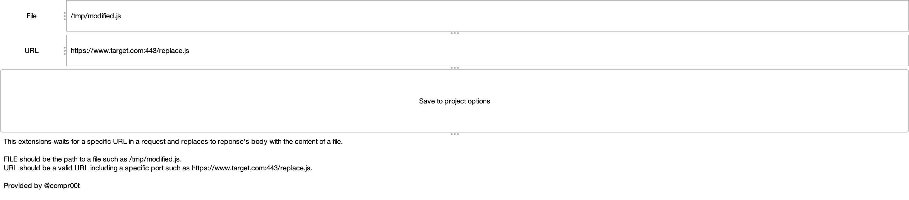

# Burp Replacer

This extensions searches for a specific URL in a request and replaces to response's body with the content of the configured file.

Usage:
* FILE should be the path to a file such as /tmp/modified.js.
* URL should be a valid URL including a specific port such as hXXps://target.com:443/replace.js.
